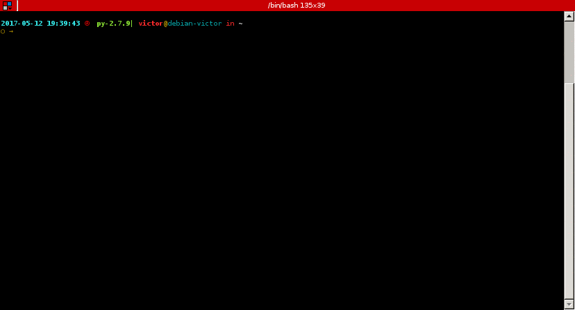

Python Rubik Solver
===================

.. image:: https://badge.fury.io/py/rubik_solver.svg
   :target: https://badge.fury.io/py/rubik_solver

.. image:: https://landscape.io/github/Wiston999/python-rubik/master/landscape.svg?style=flat
   :target: https://landscape.io/github/Wiston999/python-rubik/master
   :alt: Code Health

.. image:: https://coveralls.io/repos/github/Wiston999/python-rubik/badge.svg?branch=master
   :target: https://coveralls.io/github/Wiston999/python-rubik?branch=master

.. image:: https://travis-ci.org/Wiston999/python-rubik.svg?branch=master
   :target: https://travis-ci.org/Wiston999/python-rubik

.. image:: https://readthedocs.org/projects/rubik-solver/badge/?version=latest
   :target: https://rubik-solver.readthedocs.io/en/latest/

Rubik Cube solving library and command line utility

How to install
--------------

``$ pip install rubik_solver``

How to use
----------

As a command

As a module

.. code:: python
 
  >>> cube = 'wowgybwyogygybyoggrowbrgywrborwggybrbwororbwborgowryby'
  >>> from rubik_solver import utils
  >>> utils.solve(cube, 'Beginner')
  [F', R, U', R', U, U, F2, Y, B', U, B, U, F2, Y, R', F', U, F, R, U, U, U, F2, Y, L, F, U', F', L', U, F2, Y, L', U, L, U', R, U, R', Y, U', F', U', F, Y, B, U, B', R, U, R', Y, Y, U', L', U, L, U, F, U', F', Y, Y, U2, Y2, U, R, U', R', U', F', U, F, Y, Y, U, R, U', R', U', F', U, F, Y, F, R, U, R', U', F', U2, F, R, U, R', U', F', F, R, U, R', U', F', U, U, U, U, R, U', L', U, R', U', L, R', D', R, D, R', D', R, D, U, R', D', R, D, R', D', R, D, U, U, R', D', R, D, R', D', R, D, U]
  >>> utils.solve(cube, 'CFOP')
  [F', R, U', R', U, U, F2, Y, B', U, B, U, F2, Y, R', F', U, F, R, U, U, U, F2, Y, L, F, U', F', L', U, F2, Y, L', U, L, U', U, F', U, F, U, F', U2, F, Y, U, Y', R', U', R, U2, R', U', R, U, R', U', R, Y, Y, B, U, B', U, F', U2, F, U, F', U2, F, Y, U2, U', R, U, R', U, R, U, R', Y, Y, R', F, R, U, R', F', R, Y, L, U', L', U, Y, Y, Y, Y, U, Y, Y, Y, Y, U, Y, Y, R, U', R, U, R, U, R, U', R', U', R2]
  >>> utils.solve(cube, 'Kociemba')
  [L', F, B2, R', B, R', L, B, D', F', U, B2, U, F2, D', R2, L2, U, F2, D']

Cube Notation
-------------

For a better and more in depth explanation about the cube moves notation visit https://ruwix.com/the-rubiks-cube/notation/

The configuration string of the cube corresponds to the color of the stickers according to the following figure

::

                 ----------------
                 | 0  | 1  | 2  |
                 ----------------
                 | 3  | 4  | 5  |
                 ----------------
                 | 6  | 7  | 8  |
                 ----------------
  -------------------------------------------------------------
  | 9  | 10 | 11 | 18 | 19 | 20 | 27 | 28 | 29 | 36 | 37 | 38 |
  -------------------------------------------------------------
  | 12 | 13 | 14 | 21 | 22 | 23 | 30 | 31 | 32 | 39 | 40 | 41 |
  -------------------------------------------------------------
  | 15 | 16 | 17 | 24 | 25 | 26 | 33 | 34 | 35 | 42 | 43 | 44 |
  -------------------------------------------------------------
                 ----------------
                 | 45 | 46 | 47 |
                 ----------------
                 | 48 | 49 | 50 |
                 ----------------
                 | 51 | 52 | 53 |
                 ----------------

So, the color at position 0, corresponds to the color of the sticker BLU, the color at 1 is BU and so on ...

Colors used in the implementation are:

-  [O]range
-  [B]lue
-  [R]ed
-  [W]hite
-  [Y]ellow
-  [G]reen

NOTE
----

``Kociemba`` solver needs the following cubies at place:

-   **4** (Upper center): **YELLOW**
-   **13** (Left center): **BLUE**
-   **22** (Front center): **RED**
-   **31** (Right center): **GREEN**
-   **40** (Back center): **ORANGE**
-   **49** (Down center): **WHITE**

TODO
----
-  Improve documentation
-  Improve Kociemba Solver tests
